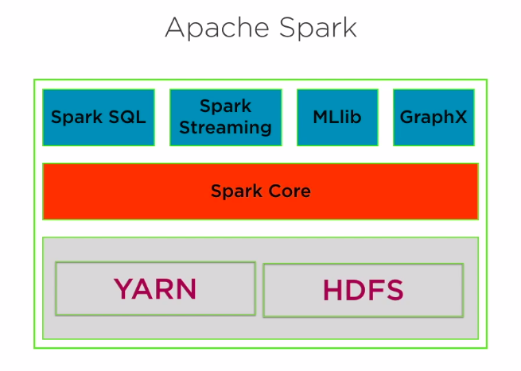
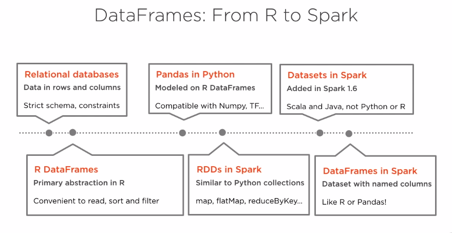
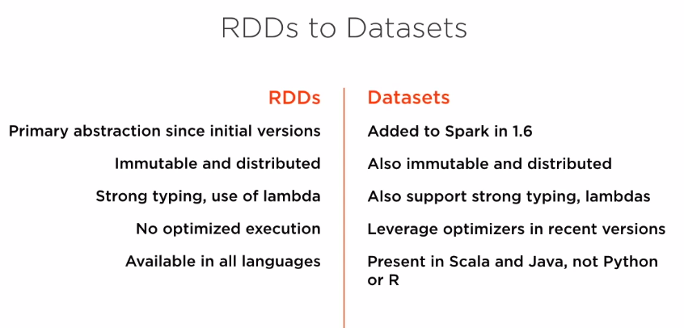
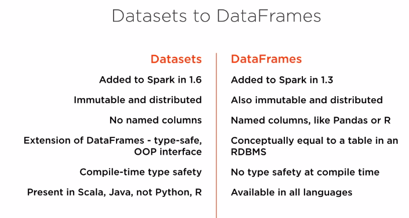
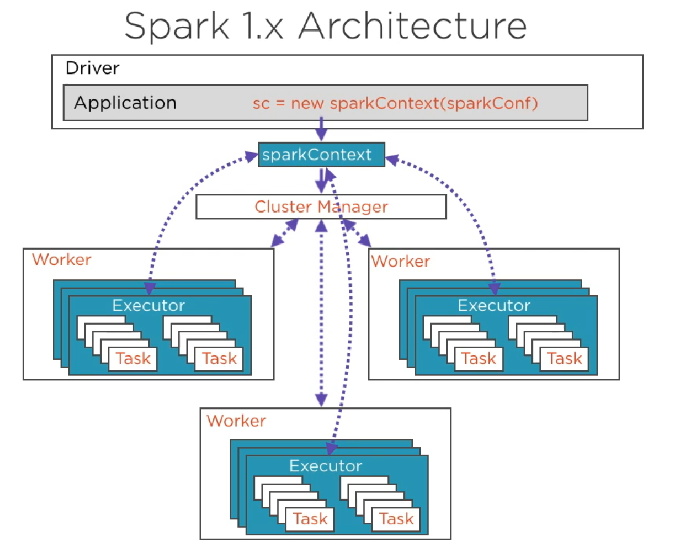

# spark

# Getting Started with Spark 2
* Spark 1.x was already a great general purpose computing engine
* Spark 2.x takes it to a new level in several ways.
* 2nd generation Tungsten engine provides 10x-100x performance improvement
* Unified APIs Datasets, DataFrames and Spark SQL
* Higher Level ML APIs
* Unified batch and streaming queries

# Spark Intro
* Spark is built on top of Hadoop spesifically YARN and HDFS.
* Once the task has been defined, this will be run as a job by the Cluster Manager. YARN, Apache Mesos or Standalone.
  
# RDD
* All operations in Spark are performed in-memory objects.
* An RDD is a collection of records.

### RDD Characteristics
###### Partitioned
* Split across data node on cluster. Data is divided into partitions. Distributed to multiple machines.
Process occurs on nodes parallel. Data is stored in memory for each node in cluster.
###### Immutable
* Once RDD created, can not be changed, edited or etc. read-only. Can not be mutated. Only two operations allowed to perform on RDD. 
* Transformation: transform into another RDD. Example: Load data, pick only 3rd column, sort the values. 
**Tranformations are executed only when a result is request. (action performed)** 
* Lazy Evaluation
* Evaluating the data only when an answer is specifically requested.
* All the transformations on a dataset are set up as a **DAG**. Spark keeps the record of the series of the transformations requested by user. It groups the transformation in an efficient way when an Action is requested.
* Action : Request a result. Example: the first 10 rows, a sum, a count 
###### Resilient
* Can be reconstructed even if a node crashes
* Every RDD keeps track of where it came from. Every transformations leds to the current RDD and are tracking by Spark as metadata. **This is called RDDs lineage**.
* Lineage also allows lazy instantiation or lazy materilization of RDDs. 

# RDDs, DataFrames, DataSets
### DataFrame
* DataFrame, represents data in tabular format. Using with Python. Very similar RDBMS.
* Every row in a DataFrame represents one record or one representation.
* Every column represent 1 variable ( a list or vector)
* Where does DataFrame come from? 
* **Starting Spark 2.0, APIs for DataSets and DataFrames have merged.**
### Comparisions

# The Architecture of Spark
* Spark is set up a classic Master/Slave configuration.  
* Master node coordinates all the processes which run on worker nodes. The master nodes run a driver program which is a seperate JVM processes.  
The driver program is responsible launching tasks. Also contains SparkContext, which is the heart of the any Spark application.
* Several groups of services run inside the driver. SparkEnv, DAGScheduler, TaskScheduler, SparkUI
* Within the driver program is where you instantiate to Spark application that you want to run. 
* Spark application uses the SparkContext as the entry point. This will kickstart the application.
* The application will then read data, perform as a series of transformations and actions. These operations are represented in the form of DAG of RDDs. Once the DAG created, then Spark internally creates physical execution plan for this DAG(also called Stages.
* Every stages split into operations on RDD partitions called Tasks.

### Spark 1.x Architecture

### Spark 2
* The overal architecture diagram of Spark 1 and Spark 2 are very similar, the difference in how the program is actually executed.
  The execution model in Spark 1 resembled a traditional database management system and is called the Volcano Iterator Model.
  There were several code and compiler optimizations, which did not exists, but they do exist in Spark 2
* Spark 2 has significant performance optimizations, which is powered by second generation, Tungsten engine.   
Project Tungsten introduce many optimizations in Spark to make the Spark engine compute much faster.
  Some of this optimizations eliminate virtual function calls, storing data that we access very frequently in registers as opposed to RAM and cache, which are slower and performing compiler optimizations such as loop unrolling and pipelining.
* Spark 2 uses Tungsten, an engine that speeds up execution 10x-20x
* In Spark 2.x, SparkContext is wrapped in SparkSession.
* SparkContext in Spark 1.x and SparkSession in Spark 2.x interacts with cluster manager.
* The cluster manager is usually YARN but it can also be Apache Mesos or Spark Standalone.
* This cluster manager is what is responsible for orchestrating the execution of jobs within the cluster.
* The cluster manager is responsible for coordinating with the various workers.
* The workers are the compute nodes within your Spark cluster.
* They are responsible for running the Spark application code that you've written.
* When the driver program creates the SparkContext, it then interacts with the cluster manager, which is responsible for splitting up executors on the worker nodes.
* Every work compute node can have several executors. These executors are distributed agents which run tasks on your worker nodes. Task are the basic unit of execution, the actual code which contains the transformations and actions that you've specified.
* Tasks are logically grouped into stages where stages are the physical units of execution.

### Accumulators and Broadcast Variables
* Different processing running on different nodes in your cluster can share variables. There are two ways to share variables. 
`Accumulators` and `Broadcast` variables.
* To understand these mechanism we should first understand how Spark processes work.
* Scala has written in Scala and Scala heavily utilizes closures. Languages that offer closures functionality treat functions as first class citizens along with other data types. 

#### First Class Function
* A function can be stored in a variable or a value.
* The return value of a function can be a function.
* A parameter of a function can be a function.

* The returned nested function is called closure. Nested function can access local variables from outer scope.
* The closures has its own copies of the local variables that are present in the outer scope, and it retains these copies even after the outer scope completely ceases to exist. Because, functions are first-class citizens, these nested functions can be passed around from one variable to another, passed in as input arguments to other functions and so on. They carry along their own copy of these local variables from the outer scope as they are passed around.

* **Task which run on individual workers are actualy closure functions**. Closures are what allow Spark to distribute their compute processes to the different nodes in cluster. **Every task will contain a copy of the variables that it works on.**
**It's important to note here that a copy of these variables will be present for every task that runs on a compute node, and a single node might have several tasks.

* To summarizing, 1 copy per task, all copying from master(no copying from one task to another- this is not efficient)

#### Shared Variables
* Broadcast variables: only 1 read-only copy per node(not 1 copy per task).
* Accumulators, broadcast to workers but can be modified by adding to it.
